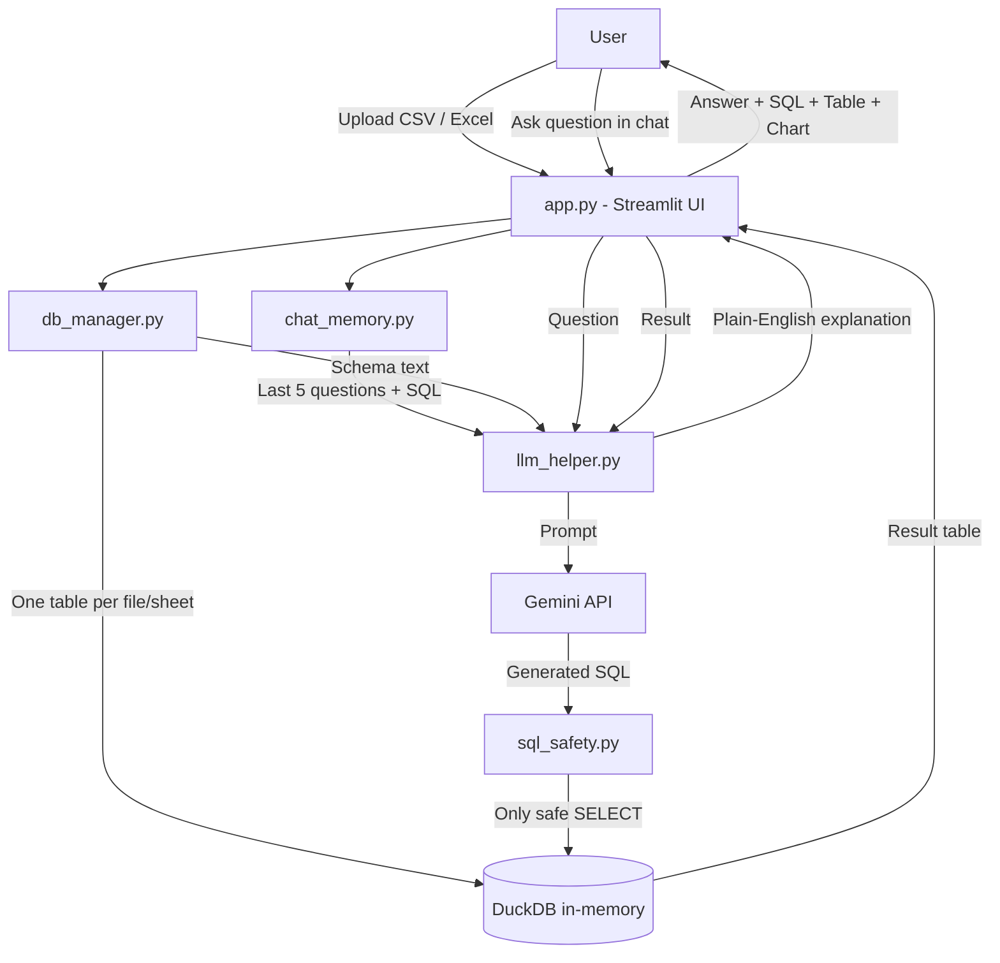

# DataChat AI - Architecture

```mermaid
flowchart TD
    U[User] -->|Upload CSV / Excel| A[app.py - Streamlit UI]
    U -->|Ask question in chat| A
    A --> D[db_manager.py]
    D -->|One table per file/sheet| DB[(DuckDB in-memory)]
    A --> M[chat_memory.py]
    M -->|Last 5 questions + SQL| L[llm_helper.py]
    D -->|Schema text| L
    A -->|Question| L
    L -->|Prompt| G[Gemini API]
    G -->|Generated SQL| S[sql_safety.py]
    S -->|Only safe SELECT| DB
    DB -->|Result table| A
    A -->|Result| L
    L -->|Plain-English explanation| A
    A -->|Answer + SQL + Table + Chart| U
```